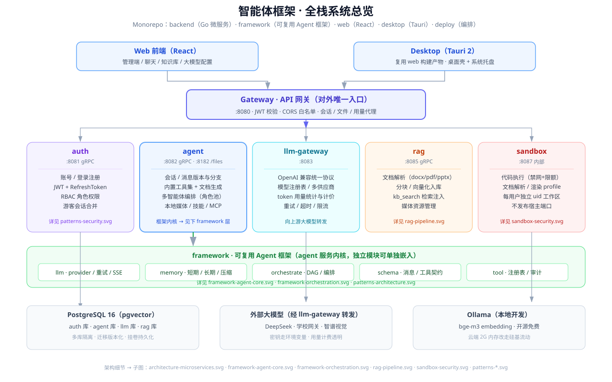

# 技术架构说明（v0.1 · P1 版本）

> **面向对象**：项目开发者（你本人）与后续维护者。
> **本文档内容**：为什么选这些技术、框架怎么分层、每个核心设计决策的来龙去脉、演进路线。
> **配套资料**：[api/framework.md](./api/framework.md)（怎么用/接口文档） · [STUDY-NOTES.md](./STUDY-NOTES.md)（原理教学） · [PROGRESS.md](./PROGRESS.md)（进度跟踪） · [图解集](./diagrams/README.md)（架构图册）

---

## 0. 系统总览（主图）



> 主图：客户端 → gateway → 五微服务 → framework 能力层 → 基础设施。各模块块标注「详见 xx.svg」，子图索引见 [diagrams/README.md](./diagrams/README.md)。

---

## 1. 项目定位

**可复用的通用 Agent 框架**，现已通过一个完整示例应用（微服务化智能体助手）落地。

三个核心原则贯穿始终：
1. **框架零业务**：framework 不包含任何业务逻辑，业务能力 = 注册进框架的工具 + 配置；
2. **配置驱动**：改配置不改代码，即可产出不同人格/能力的 Agent；
3. **接口先行**：先定契约（schema）再实现，保证多模块可替换、可测试。

---

## 2. 技术栈选型

| 技术 | 用途 | 选型理由 |
|---|---|---|
| **Go 1.26** | 框架 + 全部微服务 | 高并发、单二进制、无头文件；贴近 C++ 心智；标准库 + go.mod 依赖管理 |
| **Go module** | 依赖管理 | go.mod/go.sum 锁版本；framework 独立 module 便于单独发布 |
| **go.work** | 多模块工作区 | 本地同时开发 framework + backend，无需发布即可互相引用 |
| **OpenAI 兼容协议** | LLM 接入 | 一份实现吃遍 DeepSeek/OpenAI/Kimi/智谱等主流厂商 |
| **SSE** | 流式输出 | 打字机效果、低延迟；大模型流式标准协议 |
| **JSON Schema 子集** | 工具参数定义 | LLM 参数校验的事实标准，可扩展 |
| **标准库 testing + httptest** | 测试 | 零额外依赖；httptest 模拟 API 不花钱 |
| **zap / viper / golang-migrate** | backend 基建 | 结构化日志 / 配置加载 / 数据库迁移（P2 起用） |
| **PostgreSQL 14 + pgvector** | 数据存储 | 关系数据 + 向量检索一体（P3 起用） |

---

## 3. Monorepo 结构

```
d:/Agent/
├── framework/          ← ★ 本项目核心资产：通用 Agent 框架（独立 module）
│   ├── schema/         公共契约（零依赖）
│   ├── llm/            大模型统一接入
│   ├── tool/           工具注册/校验/执行
│   ├── memory/         记忆
│   ├── agent/          消息循环（串起全部）
│   └── examples/       cli + tool-demo
├── backend/            微服务宿主（P2 起接入 framework）
│   ├── cmd/<服务>/     各服务入口
│   ├── internal/       logger/config/errors/server 基建
│   └── migrations/     数据库版本控制
├── web/                React 前端（P2）
├── desktop/            Tauri 桌面端（P2）
├── deploy/             docker-compose / .env.example
├── docs/               本文档体系
└── scripts/            迁移脚本
```

---

## 4. 框架分层与依赖纪律

**依赖方向严格单向，禁止反向**：

```
schema（谁都不依赖）
   ↑
llm ───┐
tool ──┤  都依赖 schema
memory─┘
   ↑
agent（依赖上面全部）
   ↑
examples（使用 agent）
```

这条纪律的价值：
- **可单独测试**：每个包可独立 `go test`；
- **可独立发布**：schema 零依赖 → framework 整体可被任何 Go 项目引用；
- **变更可控**：改 llm 不影响 tool，改 schema 才需要全局评审。

---

## 5. 核心设计决策（来龙去脉）

### 5.1 schema —— 零依赖的"宪法"

**问题**：4 个模块互相传数据，各自定义类型会互相转换、改一处崩一片。
**方案**：一个零依赖包定义全部共享类型，JSON tag 与 LLM 协议对齐。
**代价**：schema 的每次变更影响全局 → 用 `Validate()` 把错误提前到启动期暴露。

### 5.2 Provider —— 多模型支持的根基

**问题**：项目要支持 DeepSeek/OpenAI 等多种模型。
**方案**：`Provider` 接口（`Chat`/`ChatStream`/`Name`）+ `OpenAICompatible` 统一客户端。OpenAI 兼容协议让"一份实现覆盖多数厂商"（DeepSeek/OpenAI/Kimi/智谱等只差 BaseURL 和模型名）。
**扩展**：协议不兼容的厂商 → 新写一个实现 `Provider` 的类型即可，agent 零改动。

### 5.3 工具安全分级（L0~L3）

**问题**：Agent 能调用工具，但"执行脚本/删文件"等高危能力必须受限。
**方案**：每个工具声明 `PermissionLevel`，`Registry.Execute` 检查 `RequiresApproval()`，L2/L3 必须经 `WithApprovalFunc` 用户确认。
**现状**：P1 只做 L0/L1（纯 Go 函数）；真正的沙盒执行器留 P4 宿主层。

### 5.4 消息循环 —— Agent 的"想→做→想"

**问题**：LLM 一次只能"给答案或要工具"，无法自主完成任务。
**方案**：`agent.Run` 的 for 循环——调 LLM → 无工具则返回 / 有工具则执行并回填 → 再调 LLM。`MaxRounds` 防死循环。
**协议细节**：assistant 的 `tool_calls` 必须与后续 `role=tool` 结果成对出现，否则模型拒绝继续（schema.Message 为此扩展了 `ToolCalls` 字段）。

### 5.5 记忆分层

**问题**：上下文窗口有限，对话无限增长。
**方案**：
- 短期：滑动窗口（`MaxMessages` 上限 + `protected` 保护 system）；
- 长期：接口先行（`LongTermMemory` 6 方法 + `MemoryEntry` + `ErrNotFound`），P1 提供 Noop / InMemory / File 三种实现，P3 换 pgvector 向量检索，上层零改动。

### 5.6 核心层零环境依赖

**问题**：框架核心层若直接读环境变量（如 `os.Getenv`），会绑定部署方式、破坏可复用性——"密钥从哪来"不应该是框架关心的事。
**方案**：
- 框架所有构造函数接收**显式参数**（如 `NewOpenAICompatible(Config{APIKey: ...})`），对密钥来源零感知；
- 环境变量读取只出现在**上层**（examples、服务层），作为调用方自己的"默认逻辑"。

这保证了 framework 可以被任何场景复用（配置文件、密钥管理服务、K8s Secret…），核心层保持极简与解耦。

---

## 6. 一次对话的完整数据流

```
用户输入
  │
  ▼
Session.Run / RunStream（agent 包）
  │ ① 用户消息进记忆（memory）
  │ ② buildRequest：system + 窗口内历史 + 工具说明书（schemas）
  ▼
Provider.Chat / ChatStream（llm 包）
  │ ③ HTTP → DeepSeek API（OpenAI 协议）
  ▼
响应：内容 或 工具调用指令（ToolCall）
  │
  ├─ 无工具 → 返回 Result，结束
  │
  └─ 有工具 →
       │ ④ Registry.Execute（tool 包）：权限检查 → 参数校验 → 执行
       │ ⑤ 结果作为 role=tool 消息回填记忆
       ▼
      回到 ②（下一轮，模型基于工具结果继续）
```

**全链路只用一个循环 + 两个接口（Provider/Tool），这就是框架的简单性所在。**

---

## 7. 与微服务的关系（P2 展望）

```
用户（Web/Desktop）
   │
   ▼
gateway(:8080) ──▶ agent-service(:8082) ──内嵌──▶ framework SDK
                        │
                        ▼
                   llm-gateway(:8083) ──▶ DeepSeek 等
```

- `agent-service` 内嵌 framework，作为 Agent 的"运行宿主"；
- `llm-gateway` 复用 `llm.Provider`，统一做密钥管理、成本统计；
- framework 保持纯库（零 HTTP、零数据库），服务层负责 IO。

---

## 8. 扩展点与演进路线

| 能力 | 当前状态 | 计划 |
|---|---|---|
| **Skill**（工具打包 + 流程说明） | 未实现 | P2：基于 Tool 的组合层 |
| **MCP**（工具标准接入协议） | 未实现 | P3：作为工具的另一来源 |
| **长期记忆 / 用户画像** | 接口 6 方法 + Noop/InMemory/File 实现 | P3：pgvector 向量检索 |
| **RAG 检索增强** | 未实现 | P3：knowledge + rag 服务 |
| **环境工具**（读写文件/执行脚本） | 仅权限钩子 | P4：宿主层 + 沙盒 |
| **多 Agent 协作** | 未实现 | P4 |

---

## 9. 安全红线（必须遵守）

1. **API Key 只走环境变量**：`os.Getenv("DEEPSEEK_API_KEY")`，禁止硬编码、禁止进任何文件；
2. **密钥文件不入库**：`deepseek_apikey.txt`、`.env` 已被 .gitignore 排除；
3. **高危工具永远需要确认**：L2/L3 工具未经用户确认一律拒绝；
4. **服务间契约改动用评审**：proto 变更必须同步升级所有调用方。

---

## 10. 平台演进记录（P2 之后，多租户视角）

> 本节的演进按「平台化 → 多租户」主线记录，配合 [PROGRESS.md](./PROGRESS.md) 的阶段编号阅读。

### 10.1 游客模式（阶段2）

```
浏览器/桌面端（未登录）
   │  localStorage 生成 guest UUID
   ▼
gateway :8080 ── 请求头 X-Guest-ID ──▶ agent-service
                                              │ FNV-1a 派生负整数 user_id
                                              ▼
                                        落库/会话合并（login 后 mergeGuestSessions）
```

- 聊天主界面按**域**拆地址：`/agent/:agentId`（每个智能体独立 URL，未登录即游客）/ `/admin/chat`（管理端域，AdminGuard 拦截）。
- 游客无配置区（能力/技能/MCP/知识库），对话可用；登录后合并游客会话。
- **游客身份跨全链路**：gateway 中间件解析 `X-Guest-ID` → gRPC metadata `x-user-id` 负值 → agent-service 落库 → **llm-gateway 也须接受负整数 user_id**（`parseUserID` 仅拒绝 0），负值空间专供游客、各自独立限流桶与用量归属。

### 10.2 角色体系与多租户资源域（阶段3）

```
                super_admin（最高超管，无归属，可指定任意域）
                /            \
        agent_admin（绑定 agent_id）    admin（绑定 agent_id，组内普通管理员）
                \            /
                  user（普通用户，tags 软关联智能体）
```

- **身份链路**：`users.tags` JSONB（`{key:"agent", value:<agent_id>}`）→ `AgentScope()` → JWT claims `agent_id` → `identity.AgentID` context → adminsvc `agentScopeFor` 锁定资源域（super_admin 显式指定 / agent_admin+admin 强制自身归属，越域 403/404）。
- **资源三态多租户**：
  - 文件态（skill/MCP）：`/skills/<agent_id>/<name>/`、`/mcp-servers/<agent_id>/` 分目录；
  - 数据库态（KB）：`knowledge_bases.agent_id` 列 + `kbInScope` 校验；
  - 会话态：`sessions.agent_id` 域列。
- **会话域三态 + 管理员落地（P2-AG）**：`listSessions` 的 `agent_id` 三态——`''`=管理端域、`'*'`=全部域不过滤、具体 ID=精确匹配。管理员登录后按角色**落地归属会话域**（超管 `/agent/*`、agent_admin/admin `/agent/{绑定域}`），管理端新建会话同样按归属回退（`getHomeScope`），不再产生 `agent_id=''` 孤儿会话。此前"登录后首屏空列表、须手动切 `*` 域"根因即登录一律落地 `/admin/chat`（管理端域）与会话实际归属脱节。
- **模块裁剪**：`/v1/admin/modules` 按角色过滤；前端 `RoleGuard` 路由守卫（agents 仅 super_admin，users 限 super_admin+agent_admin）。
- **严格多租户域守卫**：注册 / 门户登录 / 管理端建号统一走 `EnsureAgentAccessible`——目标域**必须已注册且启用**（`agents.status=1`），空串（管理端域）与 `*`（超管全门户）放行；gateway 侧建会话 / 工具 / 资源访问同样经 `GetAgentPublic` 校验域（孤儿域 404、停用域 403）。杜绝"孤儿域 / 已停用域"的账号与访问。智能体 `owner` 可选（解耦鸡生蛋），推荐顺序：先建域 → 再建组内账号 → `BindAgentOwner` 升级 `agent_admin`。
- 核心不变量：**除最高超管外，任何管理员只能管理自己智能体组**，租户间互不可感知（对标"一个独立系统"体验）。

### 10.3 审计日志（阶段4）

- 文件态 JSONL（`<LogsDir>/<agentID>/audit.jsonl`），`WithAudit` 中间件只记录已鉴权写操作，GET 不记录；`GET /v1/admin/logs` 按域/动作/操作者过滤分页。

### 10.4 桌面端租户体验（单包通用）

- **决策**：不采用"每个智能体打包一个安装包"。单安装包 + 登录页「入口模式（管理员/智能体门户）+ 智能体 ID」选择并持久化（`agent.entry_mode` / `agent.portal_agent`），与浏览器逻辑一致；`/login/:agentId` URL 直达同样支持。
- 登录态全流程闭环：登录 → 会话（游客模式可退出）→ 退出登录落地游客模式（智能体域留在原智能体、管理端落默认 `/agent/tutor`）→ 登录页提供「以游客身份继续」入口。
- 桌面端会话/凭据存储：`session.json` 落盘（tokens_* 命令）+ 系统凭据库（remember_credentials_*，keyring）；浏览器回退 localStorage。

---

*文档版本 v0.2，对应 P1 + 平台多租户演进（P2-U/V/W/X）。随项目演进持续更新。*
